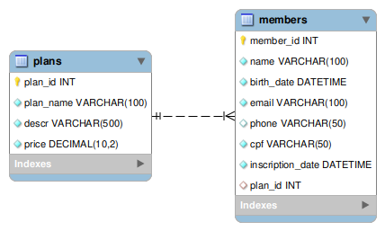

s+-# 23-2-md-proj-sql-fastdataapi

## Students
- Arthur Barreto
- Rafael Lima

## Warning

To run this project, install the requirements.txt file with the command:

```bash
pip install -r requirements.txt
```

## BIG WARNING

To run this project, use python `3.11.5`. It`s recommended to use virtual enviroment, then run:

```bash
sudo apt-get install python3.11-venv
``` 

to upgrade virtual enviroment to python `3.11.5`.


## Getting Started

### Databse Configuration

Open MySQL Workbench and create a connection. Note down the database password.

In the `.env.example` file, update the database connection information as follows, but with the appropriate information:

```bash
DATABASE_USER='algum_user'
DATABASE_PASSWORD='senha123'
DATABASE_HOST='127.0.0.1'
DATABASE_NAME='algum_nome'
DATABASE_PORT='8080'
```

After updating the information, rename the file to `.env`.

### Database Initialization

Run the SQL script (`init.sql`) in MySQL Workbench, located in the `mySQL/` folder, to create the database.

### Running the Server

Start the server by running the following command:

```bash
uvicorn main:app --reload
```

This command will start the server and create the necessary tables in the database. You are now ready to test the API.

## EER Diagram



## Video test

[A demo of this project can be viewed here](https://youtu.be/r0gUSQO9qgE)

